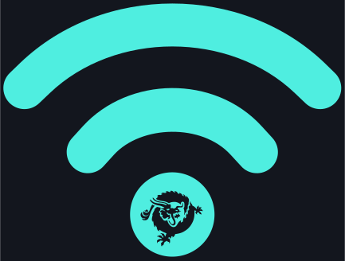

<p align="center">
  
</p>

<h1 align="center">Anvil-Mesh</h1>

<p align="center">A communication mesh for BSV apps. Signed data, real-time delivery, micropayment gating.</p>

## What it does

- **Publish** — Signed data envelopes propagate across the mesh in real time via authenticated gossip
- **Subscribe** — Real-time push via SSE, for envelopes and BRC-33 messages alike
- **Message** — Point-to-point messaging between identities. Send to a specific pubkey, not just broadcast
- **Discover** — Browse topics, metadata, publisher identity, demand, and federation health. Machines and humans can understand the mesh
- **Federate** — Canonical BRC-88 SHIP/SLAP advertisements published automatically to global trackers (Babbage's `overlay-us-1.bsvb.tech`, `overlay-eu-1`, `overlay-ap-1`, plus `users.bapp.dev`). Your node is discoverable to any BSV overlay client within ~30 minutes of boot. Includes canonical UMP + Identity topics for paymail identity resolution
- **Earn** — Non-custodial x402 micropayments per request. Payment signatures verified via script interpreter
- **Verify** — Syncs block headers, verifies BSV transactions via BEEF proofs for payment gating
- **Broadcast** — Submit BEEF transactions with validation + ARC forwarding; bearer token OR x402 payment accepted

## Install

```bash
curl -fsSL https://raw.githubusercontent.com/BSVanon/Anvil/v3.0.4/scripts/install.sh | sudo bash
```

The script detects whether you have an existing install. **Fresh installs** get the guided 6-screen tour — download binary, verify SHA256, generate identity, sync headers, show funding address. **Existing installs** get the upgrade flow — atomic SHA256-verified binary swap, auto-migrate v2→v3 LevelDB data, post-install doctor self-heal. Takes about 3 minutes either way.

The install script is served from GitHub (not a VPS) and is immutable at tagged commits. See [RELEASING.md](RELEASING.md) for supply chain details.

After a fresh install:

```bash
sudo ufw allow 8333/tcp              # mesh peering
sudo ufw allow 9333/tcp              # REST API
sudo anvil info                       # your address + auth token
```

Send 1,000,000 sats to the address shown, wait for 1 confirmation, then:

```bash
TOKEN=$(sudo anvil token)
curl -X POST http://localhost:9333/wallet/scan \
  -H "Authorization: Bearer $TOKEN"
```

Your node is live. Run `anvil help` for the full command reference.

## Upgrade

If you already have an Anvil node, the canonical upgrade path is:

```bash
sudo anvil upgrade
```

That handles download, SHA256 verification, atomic binary swap, in-process v2→v3 data migration if needed, and a post-upgrade `anvil doctor --yes` self-heal pass. Works on any version from v2.3.0 forward. For nodes running v2.2.x or earlier (where the old `anvil upgrade` predates the auto-doctor step), use the `curl … | sudo bash` install.sh one-liner above — it detects existing installs and runs the same flow.

## anvil-mesh SDK

```bash
npm install anvil-mesh
```

```typescript
import { AnvilClient } from 'anvil-mesh';

const anvil = new AnvilClient({ wif: 'your-WIF', nodeUrl: 'http://your-node:9333' });
await anvil.publish('oracle:rates:bsv', { USD: 14.35 });
const data = await anvil.query('oracle:rates:bsv');

// v0.4.0: federation discovery + health for multi-node failover
const { nodes } = await anvil.peers();
const health  = await anvil.health();
```

[SDK documentation](sdk/ts/README.md)

## Documentation

| Guide | What it covers |
|-------|---------------|
| [Publish](docs/PUBLISH.md) | Data envelopes, signing, topics, mesh gossip |
| [Earn](docs/EARN.md) | Payment models, x402 flow, monetization |
| [Discover](docs/DISCOVER.md) | Topic discovery, metadata, identity, demand, AI agents |
| [Verify](docs/VERIFY.md) | Payment verification, header sync, BEEF proofs |
| [Add Your App](docs/ADD_YOUR_APP.md) | 5-minute path from app to live mesh publisher |
| [App Integration](docs/APP_INTEGRATION.md) | Step-by-step guide for connecting your app |
| [Mesh Peering](docs/MESH_PEERING.md) | Bonds, node names, overlay discovery, connection logging |
| [API Reference](docs/API_REFERENCE.md) | All endpoints, SSE, messaging, discovery, auth |
| [Payment Policy](docs/NON_CUSTODIAL_PAYMENT_POLICY.md) | Non-custodial design constraints |
| [Capabilities](docs/ANVIL_CAPABILITIES.md) | Machine-readable reference for AI agents |

## Live network

| | |
|---|---|
| Explorer | https://anvil.sendbsv.com |
| x402 discovery | https://anvil.sendbsv.com/.well-known/x402 |
| Topic discovery | https://anvil.sendbsv.com/topics |

## Requirements

- Linux (amd64 or arm64)
- 512 MB RAM minimum, 1 GB recommended
- 500 MB disk (headers ~75MB + data stores)
- Go 1.26+ (build from source only — binary has no runtime dependencies)
- No full blockchain download. Headers only (~80 bytes x 942K blocks).

## License

See [LICENSE](LICENSE.txt).
